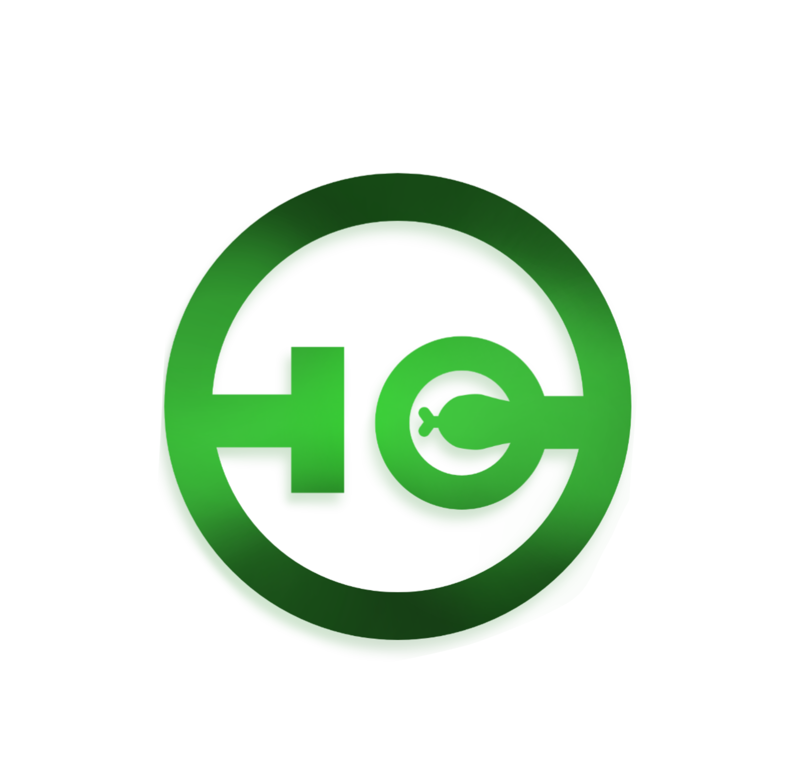

<p align = "center">
   
</p>

# PyCeal

<br> **TBA**
<br><br>

## Installation 
  &nbsp;&nbsp;&nbsp; First install the dependencies required on the requirements.txt. To do this run  the `terminal` and enter the command below.

``` powershell
    pip install -r requirements.r
```


## Table of Contents

### [1. Project Overview](#proj-obv) 
### [2. Objective](#obj) 
### [3. How It Works?](#how-works) 
- #### [What Is Steganography](#steg-info)
  - #### [Least Significant Bit](#LSB)
### [4. Code Overview](#code-info)
### [5. Tools](#tools) 
### [6. Roadmap](#roadm) 
### [7. Contributors](#contrib) 
### [8. Notes](#notes) 

<br><br>

## <a id = "proj-obv"> 🎯Project Overview </a> <br>
 This project is a id-generaeting software etc etc etc 
1. ID-image Generator: One of the features of this product is the ability to create identification card images. These images include a photo of the person, as well as their personal information such as name, date of birth, and ID number.

2. Secured ID-image: the generated output goes a step further in terms of security by incorporating image steganography; an image that contains hidden information or data that can only be accessed by authorized individuals. 

3. Embed specific "message" in an image: Another feature of this product allows for the embedding of a specific message or authentication code within the image. However, this feature is only accessible to university administrators. It can be utilized to indicate an individual's position within the university.

4. ID-Scanner: The last feature allows it to read and scan and images to seek for concealed information. This will make it easier to verify that the file is authentic and not a falsification.
<br><br>


##  <a id = "obj"> 📈 Objective </a><br>
The project is aligned with the 17 Sustainable Development Goals (SDG), specifically the following:

> 8th Decent Work and Economic Growth <br>
> 9th Industry, Innovation and Infrastracture <br>
> 11th Sustainable Cities and Communities <br>

<br>

##  <a id = "how-works"> ❓ How It Works? </a><br>
- <a id = "steg-info"> What is Steganography? </a>
  <p> <b>TBA</b> </p>


<br>

- <a id = "LSB"> Least Significant Bit (LSB) </a>
  <p> <b>TBA</b> </p>


<br><br>

#  <a id = "code-info"> Code Overview </a>
  <p> <b>TBA</b> </p>

## Debugging  

 &nbsp;&nbsp;&nbsp; When in development process or troubleshooting, it is advised to enable the debug mode. To run this open the `run.py` file and set `debug` to `True`. 
 > However, it is crucial to set it back to `False` when the product is in deployment phase as it may encounter security issues.

``` python
from pyceal import app


if __name__ =='__main__':
    app.run(debug=False) ### Set to True when debugging

```

## Static and Template Files

 &nbsp;&nbsp;&nbsp; Static files refers to the files that are unchanged when the application is running, this includes usually includes the **stylesheets**, **image folder** and **javascript** files. Templates refer to html files that will be used in the website

> As per Flask documentation, it is conventional to store the static and template files in a folder named `static` and `template` on the directory folder of the project name. 
<br>

``` console she
├───pyceal
│   ├───static
│   │   ├───css
│   │   ├───images
│   │   └───js
│   ├───templates

```

## Steganography Script
  &nbsp;&nbsp;&nbsp;
<br>

## Routes
  &nbsp;&nbsp;&nbsp;
<br>

<br>
## Forms
  &nbsp;&nbsp;&nbsp;
<br>

<br>
## Models
  &nbsp;&nbsp;&nbsp;
<br>

<br>
## Login
  &nbsp;&nbsp;&nbsp;
<br>


<br>


## Database Configuration 
  &nbsp;&nbsp;&nbsp; Database profile and presets is found on the ``config.py`` file. 
  > The preset configuration will create a database file named ``app.db``. 
  
   
<br><br>


<br><br>


##  <a id = "tools"> ⚒️ Tools and Dependencies </a><br>
The following listed tools may be **POSSIBLY** utilized in the project. <br>

- [x] Python <br> 
- [x] Flask <br> 
- [x] Django <br> 
- [x] HTML/CSS <br> 
- [x] Bootstrap <br> 
- [x] Javascript <br>

<br><br>
##  <a id = "roadm"> 🛣️ Roadmap </a> <br>

| Goal # | Description | Date 
| --- | --- | --- | 
|  1 | System Design | March 30-April 2 |
|  2 | Front-end Development | April 3-6 |
|  3 | Back-end Development | April 6-12 | 
| <del> 4 </del> | <del> Code Integration </del> | <del>April 12-19 </del> |
|  5 | Debugging | April 20-24 |
|  6 | Documentation  | <del>April 24-26</del> <br> April 26- May 2|

<br><br>


##  <a id = "contrib"> 👷‍ Contributors </a> <br>

| Name | Role | E-mail | Other Contacts |
| --- | --- | --- | --- |
| <a href = "https://github.com/DirkSteven">Dirk Steven E. Javier</a> | Project Leader | dirkjaviermvp@gmail.com | Allonsy -Discord |
| <a href = "https://github.com/HusPhil">Fhil Joshua Caguicla </a>| a | a | a |
| <a href = "https://github.com/LanceAndrei04">Lance Andrei Espina </a>| a | a | a |
| <a href = "https://github.com/VinceAbella">Vince Jericho Abella </a>| a | a | a |


<br><br>


##  <a id = "notes"> 📝 Notes </a><br>
<br><br>
